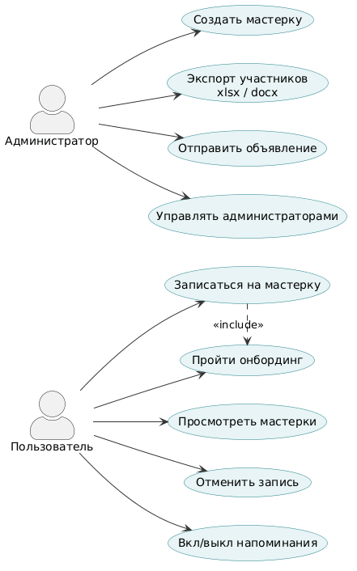

# Debate_club_bot

Ключевые термины:
1. Мастерка - мероприятие, проводимое клубом
2. Спикер, игрок, пользователь - участник клуба, которые посещает мастерки
3. Руковод, руководитель - администратор сообщества

## Use Cases

### Пользователь

| ID    | Название               | Описание                                                        |
|-------|------------------------|-----------------------------------------------------------------|
| UC-01 | Пройти онбординг       | Ввести имя и фамилию при первом запуске бота                    |
| UC-02 | Просмотреть мастерки   | Посмотреть список предстоящих мастерок с датой и местом         |
| UC-03 | Записаться на мастерку | Выбрать мастерку и подтвердить участие                          |
| UC-04 | Отменить запись        | Отменить свою запись на мастерку                                |
| UC-05 | Управлять напоминаниями| Включить или выключить напоминания за 24ч и 1ч до мастерки     |

### Администратор

| ID    | Название                    | Описание                                                                          |
|-------|-----------------------------|-----------------------------------------------------------------------------------|
| UC-06 | Создать мастерку            | Задать название, дату, место и описание новой мастерки                            |
| UC-07 | Редактировать мастерку      | Изменить поля предстоящей мастерки (название, дату, место, описание)              |
| UC-08 | Удалить мастерку            | Удалить предстоящую мастерку                                                      |
| UC-09 | Экспортировать участников   | Выгрузить список записавшихся на мастерку в файл xlsx или docx                    |
| UC-10 | Отправить объявление        | Разослать сообщение всем участникам клуба                                         |
| UC-11 | Управлять администраторами  | Назначить или снять роль администратора у пользователя                            |
